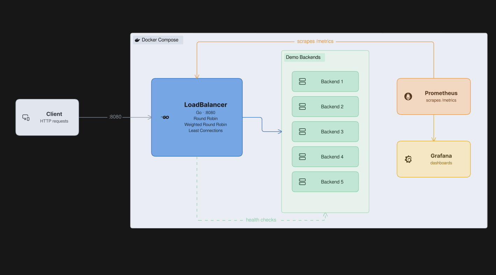
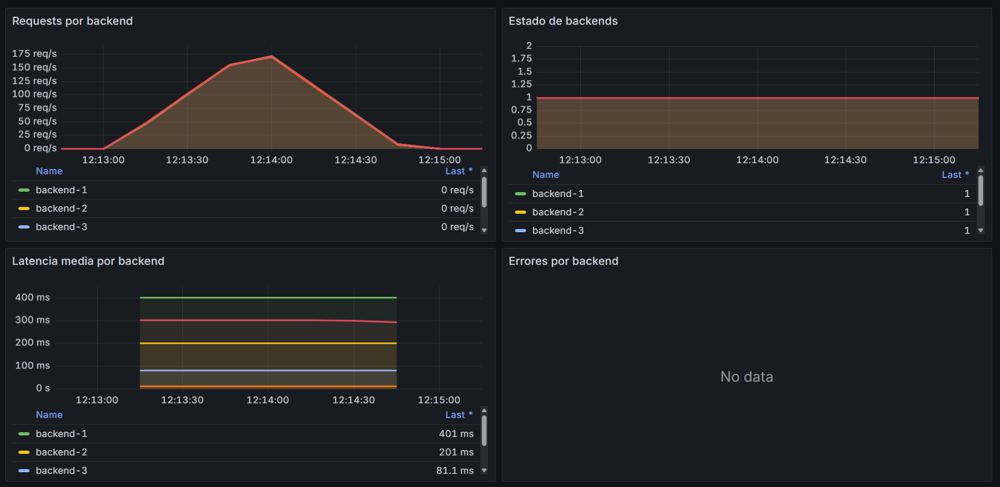
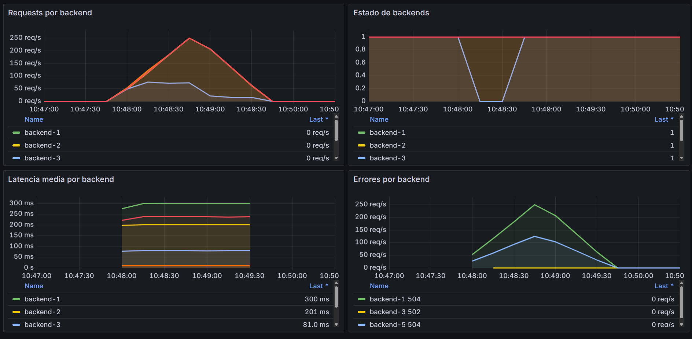

# Load Balancer

Load Balancer is an HTTP load balancer written in Go. It provides a configurable reverse proxy, multiple balancing strategies, backend health checks, retries, rate limiting, Prometheus metrics, and graceful shutdown.



## Features

- Round robin, weighted round robin, and least connections balancing
- Active health checks with automatic backend recovery
- Configurable request timeouts and retry attempts
- Per-client token bucket rate limiting
- Prometheus metrics and Grafana dashboard provisioning
- Health and readiness endpoints
- Demo backends and a load testing command
- Unit tests, integration tests, race tests, and benchmarks
- Docker and Docker Compose support

## Requirements

- Go 1.26 or newer
- Docker and Docker Compose (for the containerized demo)
- GNU Make (optional)

## Quick Start with Docker

Start Load Balancer, five demo backends, Prometheus, and Grafana:

```bash
docker compose up --build
```

The services are available at:

| Service | URL |
| --- | --- |
| Load Balancer | http://localhost:8080 |
| Prometheus | http://localhost:9090 |
| Grafana | http://localhost:3000 |

Grafana uses `admin` as both the default username and password.

Stop the environment with:

```bash
docker compose down
```

## Local Setup

Copy the example configuration:

```powershell
Copy-Item configs/config.example.yaml configs/config.local.yaml
```

Start a demo backend in each terminal, changing `BACKEND_ID`, `PORT`, and `RESPONSE_DELAY` as needed:

```powershell
$env:BACKEND_ID="backend-1"
$env:PORT="9001"
$env:RESPONSE_DELAY="200ms"
go run ./cmd/demo-backend
```

The example configuration expects three backends on ports `9001`, `9002`, and `9003`. Once they are running, start the load balancer:

```powershell
go run ./cmd/loadbalancer --config configs/config.local.yaml
```

Send a request to verify the setup:

```powershell
Invoke-RestMethod http://localhost:8080/
```

## Configuration

Load Balancer is configured with YAML. See [`configs/config.example.yaml`](configs/config.example.yaml) for a complete example.

```yaml
server:
  listen_address: ":8080"
  request_timeout: 5s
  shutdown_timeout: 10s

balancer:
  strategy: least_connections

health_check:
  enabled: true
  interval: 2s
  timeout: 500ms
  path: /health

retries:
  max_attempts: 2

rate_limit:
  enabled: false
  requests_per_second: 10
  burst: 20

backends:
  - id: backend-1
    url: http://localhost:9001
    weight: 5
```

Supported balancing strategies are `round_robin`, `weighted_round_robin`, and `least_connections`.

## Observability

The HTTP server exposes:

- `/healthz` — reports whether the process is running
- `/readyz` — reports whether at least one backend is available
- `/metrics` — exposes Prometheus metrics

Available metrics include:

- `loadbalancer_requests_total`
- `loadbalancer_backend_active_requests`
- `loadbalancer_backend_healthy`
- `loadbalancer_backend_errors_total`
- `loadbalancer_retries_total`

### Demonstration Scenarios

The Docker demo uses backend delays between `10ms` and `400ms`, plus one backend with `50ms` to `550ms` of variable latency. Two configurations demonstrate normal operation and failure handling.

| Scenario | Configuration | Request timeout | Result |
| --- | --- | --- | --- |
| Stable load | [`config.docker.yaml`](configs/config.docker.yaml) | `800ms` | 50,000 successful requests, no errors |
| Resilience test | [`config.docker.resilience.yaml`](configs/config.docker.resilience.yaml) | `300ms` | Timeouts, retries, failover, and backend recovery |

#### Stable Load

The stable scenario completed 50,000 requests at approximately 987 requests per second, with all backends healthy and no failed responses.



Run it with:

```powershell
Remove-Item Env:LOADBALANCER_CONFIG -ErrorAction SilentlyContinue
docker compose up -d --force-recreate loadbalancer
go run ./cmd/loadtest --url http://localhost:8080/api/products --requests 50000 --concurrency 200 --timeout 10s
```

#### Resilience Test

The resilience scenario uses a shorter timeout and briefly stops one backend. In the recorded run, Load Balancer processed 50,000 requests at approximately 823 requests per second, including 43,862 successful responses, 6,134 timeouts, 4 connection failures, and 17,050 retries.



Start the resilience configuration and load test in one terminal:

```powershell
$env:LOADBALANCER_CONFIG="config.docker.resilience.yaml"
docker compose up -d --force-recreate loadbalancer
go run ./cmd/loadtest --url http://localhost:8080/api/products --requests 50000 --concurrency 200 --timeout 10s
```

While the load test is running, stop and recover a backend from another terminal:

```powershell
docker compose stop backend-3
Start-Sleep -Seconds 12
docker compose start backend-3
```

The demo configuration uses millisecond-scale backend latency. Durations measured in seconds are reserved for operational settings such as shutdown grace periods, health-check intervals, and load-test client timeouts.

## Load Testing

Run the included load testing command against a running instance:

```bash
go run ./cmd/loadtest --url http://localhost:8080/ --requests 200 --concurrency 20
```

Use `--timeout` to change the per-request timeout. The command reports throughput, errors, status codes, and latency percentiles.

## Development

Run the test suite:

```bash
go test ./...
```

Run the complete verification process:

```bash
make verify
```
